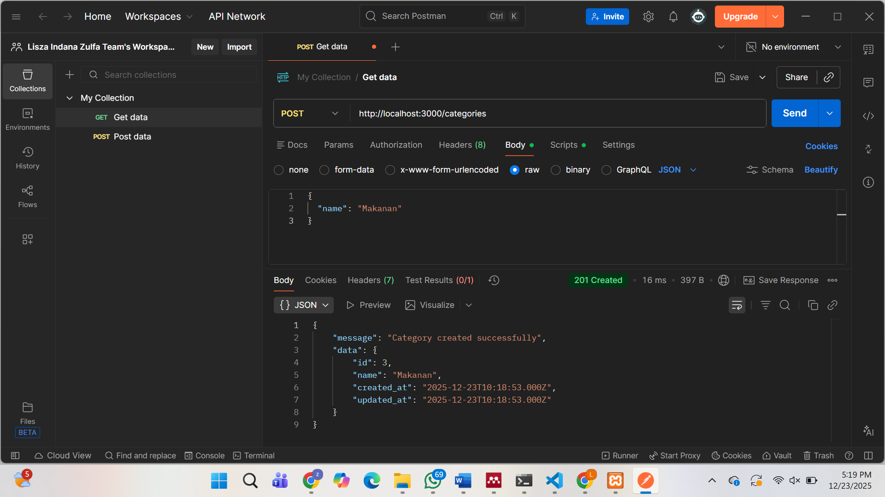
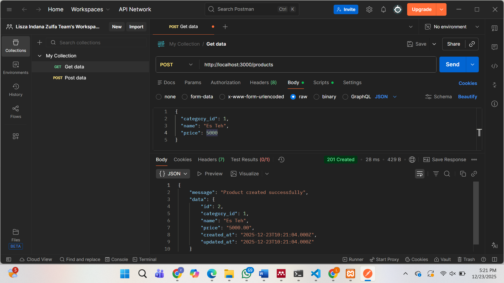
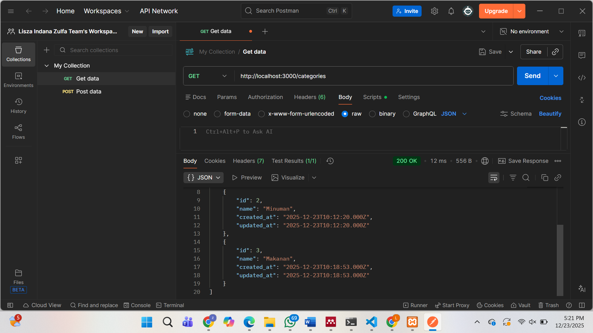
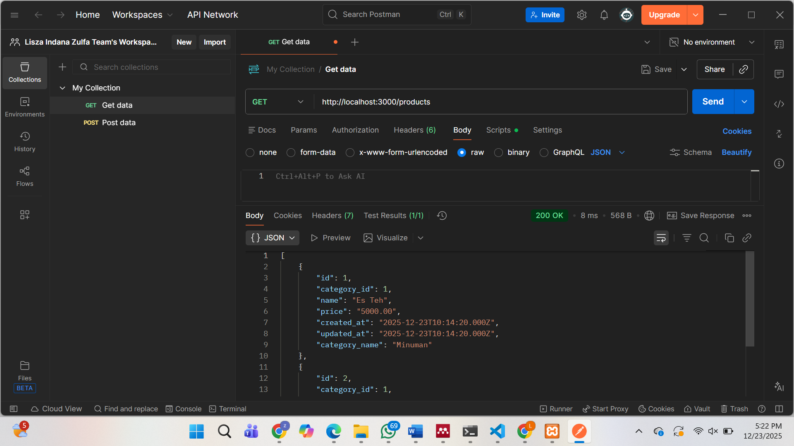
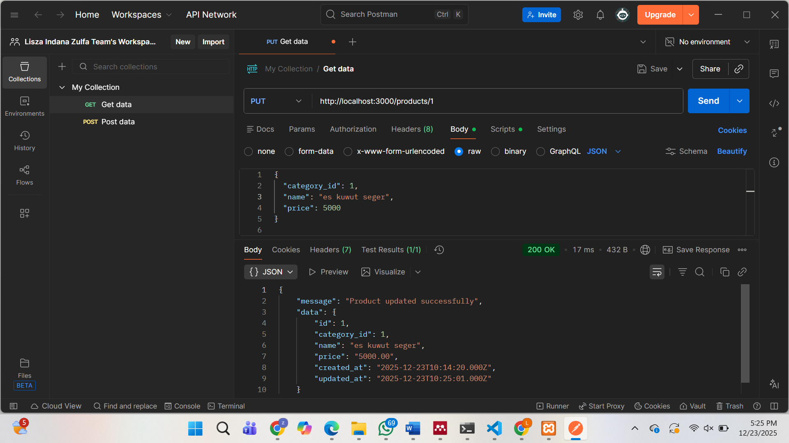
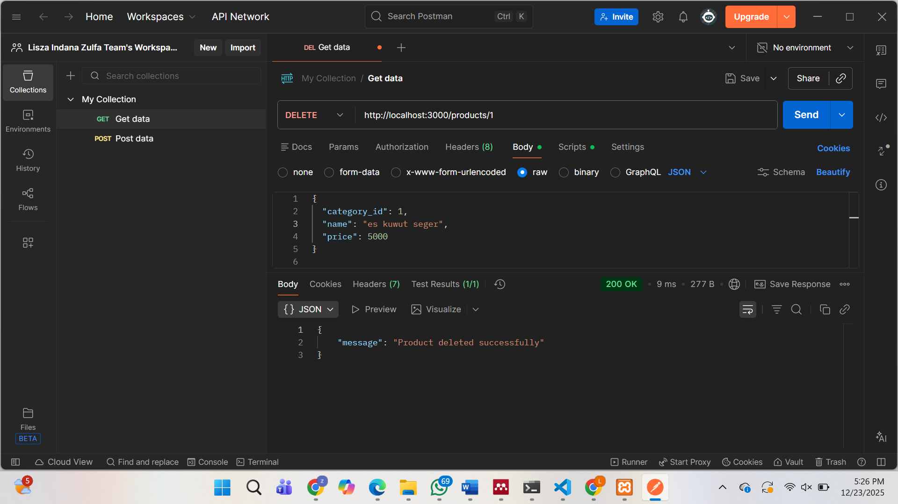

Projek ini merupakan sebuah aplikasi RESTful API berbasis Node.js yang dirancang khusus untuk mengelola data inventaris secara digital. Aplikasi ini menghubungkan logika pemrograman backend dengan database relasional MySQL untuk menyimpan informasi mengenai kategori dan produk secara terstruktur.

Secara teknis, projek ini memiliki beberapa karakteristik utama:
1. Arsitektur Berbasis Modul: Kode program disusun menggunakan struktur yang rapi dengan memisahkan tanggung jawab
   antara konfigurasi database (config), logika bisnis (controllers), dan pengaturan jalur akses (routes).
2. Pengelolaan Entitas Saling Terelasi: Sistem mengelola dua tabel utama, yaitu categories dan products, di mana
   setiap produk secara otomatis terhubung dengan kategorinya melalui relasi Foreign Key.
3. Operasi CRUD Lengkap: Pengguna dapat melakukan manipulasi data secara menyeluruh, mulai dari menambahkan data
   baru (Create), menampilkan daftar atau detail data (Read), memperbarui informasi (Update), hingga menghapus data (Delete).
4. Standarisasi Format JSON: Seluruh komunikasi antara klien dan server menggunakan format JSON, memastikan
   pertukaran data berlangsung secara ringan dan standar sesuai protokol web modern.
5. Otomatisasi Timestamp: Setiap data yang masuk atau berubah akan mencatat waktu kejadiannya secara otomatis
   melalui kolom created_at dan updated_at, yang memberikan kemudahan dalam pelacakan riwayat data.
6. Keamanan dan Efisiensi: Penggunaan variabel lingkungan (.env) memastikan kredensial database tetap aman,
   sementara penggunaan ES Modules (import/export) menjadikan kode lebih modern dan mudah dipelihara.

Projek ini telah divalidasi melalui pengujian menggunakan Postman, di mana setiap fungsi terbukti mampu menghasilkan respon status HTTP yang tepat dan data yang akurat sesuai dengan permintaan pengguna.

Berikut merupakan bukti Screenshot POSTMAN
1. POST

2. GET

3. PUT

4. DELETE

